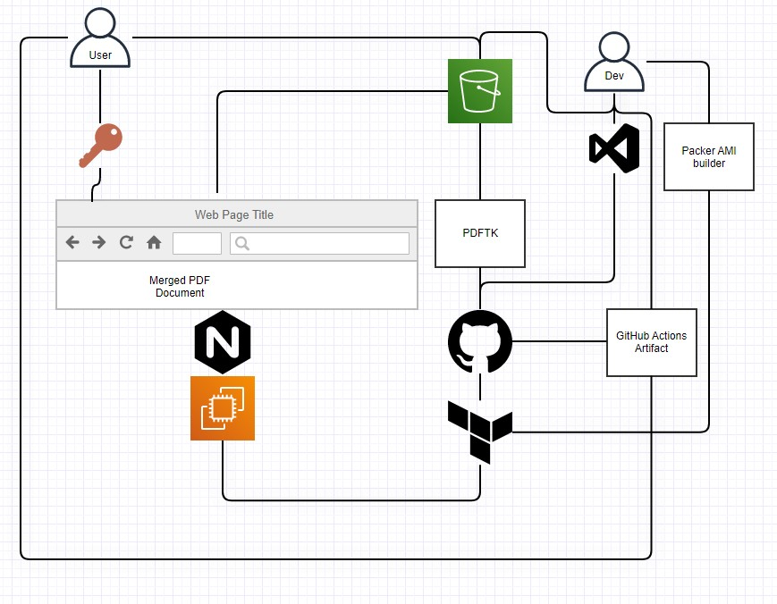

[](https://github.com/mojumah/pdftk-environment/actions/workflows/pdftk-environment.yml)

Solution Architecture



Prerequisites 

- S3 Browser Installed on a Microsoft Windows (10 or 11) System 

- github-actions user with the following policy:

```json
{
    "Version": "2012-10-17",
    "Statement": [
        {
            "Sid": "VisualEditor0",
            "Effect": "Allow",
            "Action": [
                "sts:AssumeRole",
                "sts:TagSession"
            ],
            "Resource": "arn:aws:iam::xyz:role/github-actions"
        }
    ]
}
```

- github-actions role with the following Trust relationship

```json
{
    "Version": "2012-10-17",   
    "Statement": [
        {
            "Sid": "",
            "Effect": "Allow",
            "Principal": {
                "AWS": "arn:aws:iam::xyz:user/github-actions"
            },
            "Action": [
                "sts:AssumeRole",
                "sts:TagSession"
            ]
        }
    ]
}
```

Automated pdf page merging Workflow:

1- Create an S3 bucket and upload the pdf files you want to merge to the bucket. 

2- In GitHub click on Actions. From the left menu, click on GitHub Actions Demo, and then click on Run workflow.

3- Update merged-pdf-certificates.html with the S3 created because of step 2

4- Add the html file to var/www of the server created by Terraform main.tf